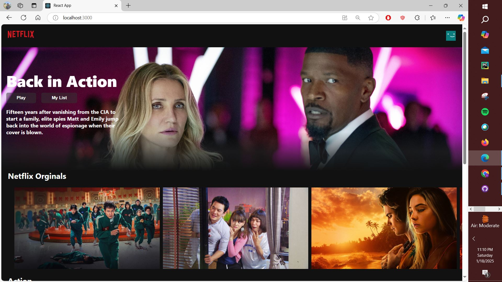
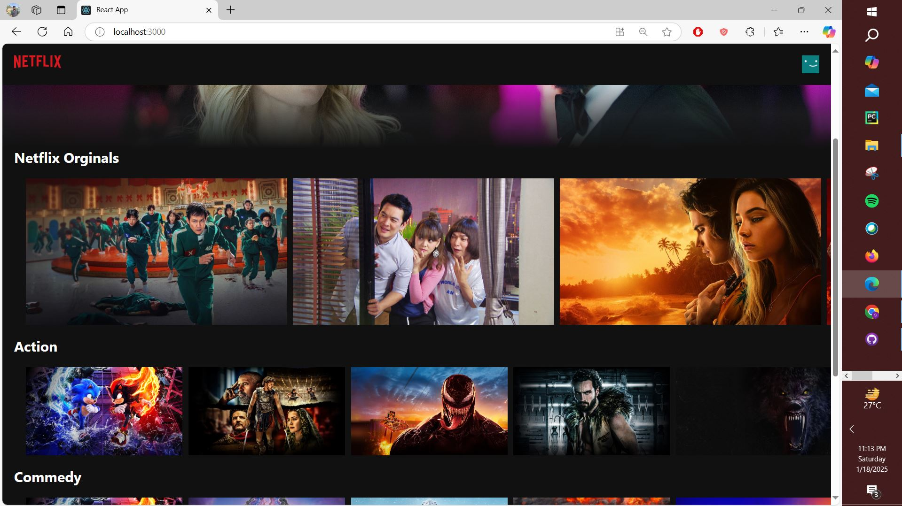
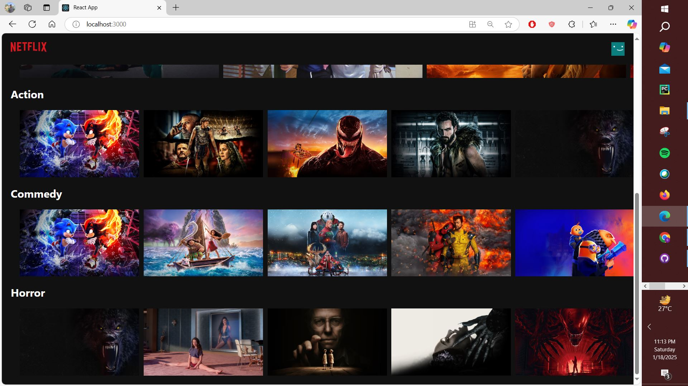
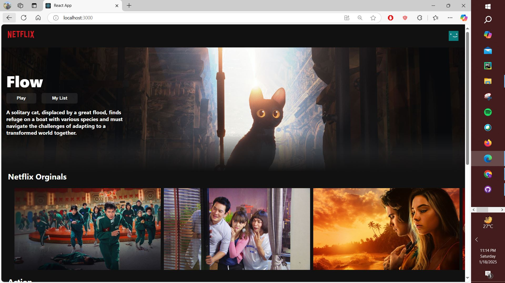
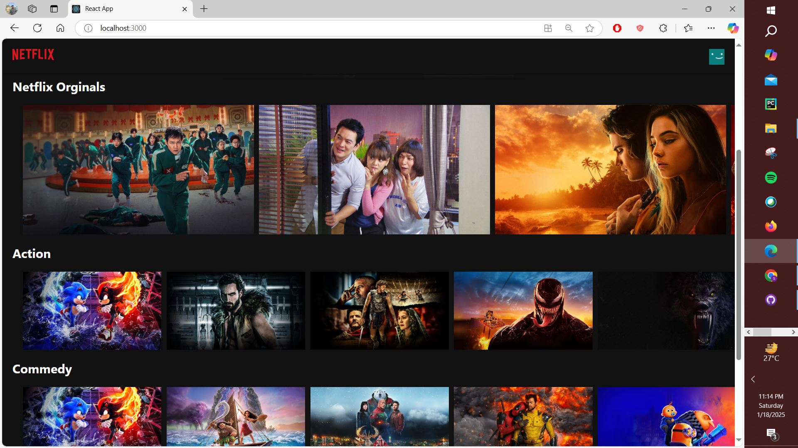

# Netflix Clone

Welcome to the Netflix Clone project! This application replicates the core features of Netflix, including browsing movies and TV shows, and watching trailers.

---







---

## 🚀 Getting Started

### Prerequisites
Ensure you have the following installed:
- Node.js (>=14.x)
- npm (Node Package Manager)

### Installation
1. Clone this repository:
   ```bash
   git clone <repository-url>
   ```
2. Navigate to the project directory:
   ```bash
   cd netflix-clone
   ```
3. Install dependencies:
   ```bash
   npm install
   ```

---

## 🎮 Available Scripts

### `npm start`
Launches the app in development mode.
- Open [http://localhost:3000](http://localhost:3000) to view it in your browser.
- The page will reload automatically as you edit the code.

### `npm test`
Runs the test suite in interactive watch mode.

### `npm run build`
Builds the app for production in the `build` folder.
- Optimized for performance and deployment.

### `npm run eject`
**Warning:** This is a one-way operation. Once you `eject`, it cannot be undone. Use this to customize the build configuration.

---

## 📁 Project Structure
```plaintext
Netflix Clone
├── public/
│   ├── index.html
│   ├── manifest.json
│   └── robots.txt
├── src/
│   ├── components/
│   │   ├── Banner/
│   │   ├── NavBar/
│   │   └── RowPost/
│   ├── constants/
│   ├── App.css
│   ├── App.js
│   ├── axios.js
│   ├── index.js
│   └── urls.js
├── .gitignore
├── package.json
└── README.md
```

---

## 🌐 API Integration
This project uses the TMDB API to fetch movie and TV show data.

---

## 📚 Learn More
- [React Documentation](https://reactjs.org/)
- [TMDB API Documentation](https://www.themoviedb.org/documentation/api)

---

## 🙌 Contributions
Contributions are welcome! Feel free to open issues or submit pull requests for improvements.

---

## 📜 License
This project is licensed under the MIT License. See the LICENSE file for details.

---

## 🛠️ Author
Developed with ❤️ by **Sreejith P**
